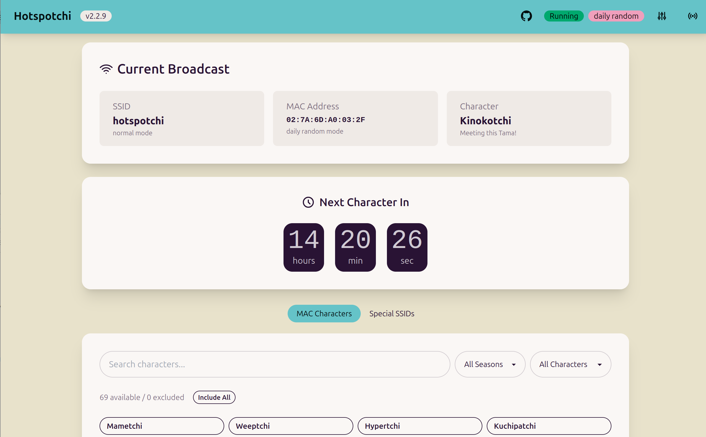

# Hotspotchi


[](https://github.com/mensfeld/hotspotchi/actions/workflows/ci.yml)
[](https://www.python.org/downloads/)
[](https://opensource.org/licenses/MIT)

Create WiFi access points with custom MAC addresses and SSIDs for meeting characters in Tamagotchi Uni's **Tama Search** feature.

## Why Hotspotchi?

The Tamagotchi Uni's **Tama Search** feature lets you meet special characters by detecting nearby WiFi networks. The character you encounter depends on the last two bytes of the WiFi access point's MAC address, or in some cases, specific SSIDs for event-exclusive characters.

The problem? You'd need to physically visit different locations with different WiFi networks to collect all characters - or wait for special real-world events that may never happen in your area.

**Hotspotchi solves this** by turning your Raspberry Pi into a WiFi hotspot that can spoof any MAC address or SSID, letting you:

- Meet all ~100 characters from home without traveling
- Access event-exclusive characters (like Sanrio collaborations) that require specific SSIDs
- Automatically rotate through characters daily, or cycle through the entire collection
- Track which characters you've encountered via the web dashboard

Perfect for completionists, rural players without access to many WiFi networks, or anyone who just wants to meet their favorite Tamagotchi characters without leaving the house.



## Features

- **80 MAC-based characters** - Meet different Tamagotchi characters by changing the WiFi MAC address (includes seasonal characters)
- **21 special SSID characters** - Access event-exclusive characters with special network names
- **Multiple rotation modes**:
  - `daily_random` - Different character each day, same all day (default)
  - `random` - New random character each boot
  - `cycle` - Progress through all characters in order
  - `fixed` - Always show a specific character
  - `disabled` - Use device default MAC
- **Character name in SSID** - WiFi shows "Mametchi Hotspotchi" for easy identification
- **Seasonal filtering** - Only selects characters available in the current season
- **Web dashboard** - Monitor and control via browser
- **Raspberry Pi optimized** - Works with hostapd + dnsmasq

### Network Naming

By default, Hotspotchi includes the current character's name in the WiFi network name:

```
Mametchi Hotspotchi
Kuchipatchi Hotspotchi
Santaclautchi Hotspotchi
```

This makes it easy to see which character is currently active when scanning for WiFi networks on any device. The feature can be disabled in the config if you prefer a generic "Hotspotchi" name.

**Note:** Special SSID characters (like Sanrio collaborations) are not affected - they require specific network names to work and will use their required SSID instead.

### How Daily Random Works

The `daily_random` mode uses a date-based seed to select a character. This means:
- **Same character all day** - The same character is selected throughout the entire day
- **Changes at midnight** - A new character is selected when the date changes
- **Deterministic** - If you restart the service, you'll get the same character for that day
- **Pool of ~100** - By default, both MAC-based (80) and special SSID characters (21) are included in the rotation

This design ensures a consistent experience throughout the day while still providing variety over time.

## Quick Start

```bash
# Clone the repository
git clone https://github.com/mensfeld/hotspotchi.git
cd hotspotchi

# Run the installer
sudo bash scripts/install.sh
```

The installer will set up everything automatically, including systemd services for auto-start.

## Security

**Hotspotchi requires root privileges** to manage network interfaces and system services.

The WiFi network is secured by default:
- A random 16-character password is generated daily
- Tamagotchi only needs to *detect* the network name, not connect to it
- The password prevents random devices from joining your hotspot

You can set a fixed password or open network in the config if needed, but the default is recommended.

## Usage

After installation, both the hotspot and web dashboard run automatically as systemd services.

### Systemd Services

```bash
# Check status
sudo systemctl status hotspotchi

# View logs
journalctl -u hotspotchi -f

# Restart after config changes
sudo systemctl restart hotspotchi
```

### Web Dashboard

Access at `http://raspberrypi.local:8080` (or your Pi's IP address).

The dashboard shows:
- Current SSID and MAC address
- Active character name
- Countdown to next character (daily mode)
- Searchable character browser
- Special SSID selector
- Character exclusion controls

### Character Exclusions

Want to keep the "discovery" aspect of Tama Search? You can exclude specific characters from the rotation modes (daily_random, random, cycle), so you won't encounter them at home.

**Via Web Dashboard:**
- Hover over any character and click the `-` button to exclude it
- Excluded characters show with an `X` badge and appear faded
- Use the filter dropdown to view "Excluded Only" or "Available Only"
- Click "Include All" to reset all exclusions

### Command Line (Optional)

For troubleshooting or manual control:

```bash
# List all characters
hotspotchi list-characters

# List special SSIDs
hotspotchi list-ssids

# Interactive menu
sudo hotspotchi interactive

# Manual start (not needed if using systemd)
sudo hotspotchi start
```

## Configuration

Edit `/etc/hotspotchi/config.yaml`:

```yaml
# WiFi interface (usually wlan0 on Raspberry Pi)
wifi_interface: wlan0

# Concurrent mode: run hotspot while staying connected to home WiFi
# Requires compatible WiFi chipset (Pi 3B+/4/5 typically support this)
concurrent_mode: false

# SSID mode: normal, special, or custom
ssid_mode: normal
default_ssid: Hotspotchi

# MAC mode: daily_random, random, cycle, fixed, or disabled
mac_mode: daily_random

# Include special SSID characters in random rotation (default: true)
include_special_ssids: true

# Include character name in SSID (e.g., "Mametchi Hotspotchi") (default: true)
include_character_in_ssid: true

# For fixed mode - character index (0 = Mametchi)
fixed_character_index: 0

# For special mode - SSID index (0 = Angel & Devil)
special_ssid_index: 0

# Web server settings
web_host: "0.0.0.0"
web_port: 8080
```

## How It Works

### With Tamagotchi Uni

1. Start the Hotspotchi hotspot on your Raspberry Pi
2. On your Tamagotchi Uni, go to **Tama Search**
3. Select the network when it appears
4. Meet the character determined by the current MAC/SSID!

### MAC-Based Characters

Characters are determined by the last two bytes of the MAC address. Hotspotchi uses the format:

```
02:7A:6D:A0:XX:YY
```

Where:
- `02` = Locally administered unicast address
- `7A:6D:A0` = "TAMA" signature
- `XX:YY` = Character identifier

### Special SSIDs

Some characters are triggered by specific WiFi network names (SSIDs) that were originally only available at special events in Japan. Hotspotchi includes 21 known special SSIDs:

- **Angel & Devil** - World Tamagotchi Tour
- **Makiko** - Bandai Cross stores
- **1123 Mametchi** - 28th Anniversary event
- And more! Run `hotspotchi list-ssids` for the full list.

### Seasonal Characters

Set your Tamagotchi's date to meet seasonal characters:

| Season | Months | Characters |
|--------|--------|------------|
| Spring | Mar-May | Rosetchi, Yotsubatchi, Hanafuwatchi, Musiharutchi |
| Summer | Jun-Aug | Acchitchi, Tokonatchi, Tropicatchi, Yashiharotchi |
| Fall | Sep-Nov | Dekotchi, Youngdrotchi, Witchi, Pumpkitchi |
| Winter | Dec-Feb | Amiamitchi, Santaclautchi, Akahanatchi, Yukipatchi |

## Troubleshooting

### Raspberry Pi becomes unreachable after starting hotspot

**This is expected behavior.** When Hotspotchi starts the WiFi hotspot, it takes over the `wlan0` interface. If your Pi was connected to your home WiFi via `wlan0`, it will disconnect.

**Solutions:**

1. **Use Ethernet for management** (recommended) - Connect your Pi via Ethernet cable before starting the hotspot

2. **Enable concurrent mode** (Pi 3B+/4/5) - Run hotspot while staying connected to your home WiFi:
   ```yaml
   # /etc/hotspotchi/config.yaml
   concurrent_mode: true
   ```

3. **Use a second WiFi adapter** - Add a USB WiFi adapter for your home network

### WiFi not appearing

```bash
# Check service status
sudo systemctl status hotspotchi

# Check for errors
journalctl -u hotspotchi -n 50

# Unblock WiFi if blocked
sudo rfkill unblock wifi
```

## Updating

```bash
cd ~/hotspotchi
sudo bash scripts/upgrade.sh
```

## Uninstallation

```bash
sudo bash scripts/uninstall.sh
```

## Contributing

Contributions are welcome! Characters are stored in `src/hotspotchi/data/characters.yaml` for easy editing.

**To add a MAC-based character:**

```yaml
- byte1: 0x04
  byte2: 0x00
  name: NewCharacter
  season: spring  # Optional
```

**To add a special SSID character:**

```yaml
- ssid: YourSSIDString32CharsLong1234567
  character_name: Character Name
  notes: Where this SSID was discovered
  active: true
```

## License

This project is licensed under the MIT License - see the [LICENSE](LICENSE) file for details.

## Acknowledgments

- Tamagotchi community for discovering MAC/SSID mappings
- [Tamagotchi Wiki](https://tamagotchi.fandom.com/) for character information
- Everyone who shared special event SSIDs

## Disclaimer

This project is not affiliated with or endorsed by Bandai. Tamagotchi is a registered trademark of Bandai.
